# Secure Ecommerce Web Application

A secure ecommerce platform built using Spring Boot, JSP, Spring Security and SQL Server.

## Features

✔ User Registration & Login  
✔ Password Encryption (BCrypt)  
✔ Product Listing  
✔ Shopping Cart  
✔ Checkout System  
✔ Admin Product Management  
✔ Stock Management  
✔ Secure Authentication  

## Tech Stack

Backend:
Spring Boot  
Spring Security  
Hibernate / JPA  

Frontend:
JSP  
Bootstrap  

Database:
Microsoft SQL Server  

## Screenshots

### Login Page
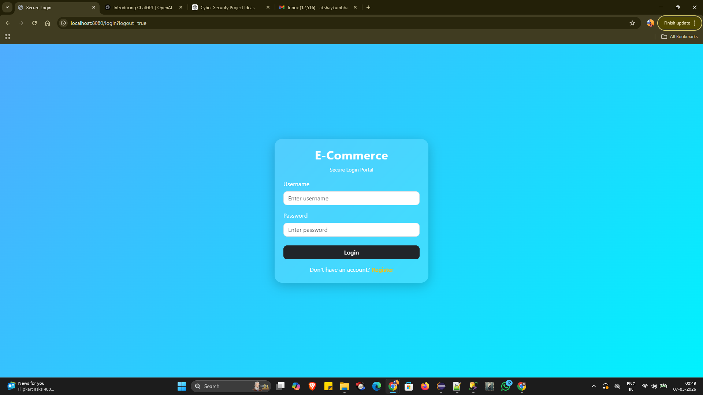

### User Registration Page
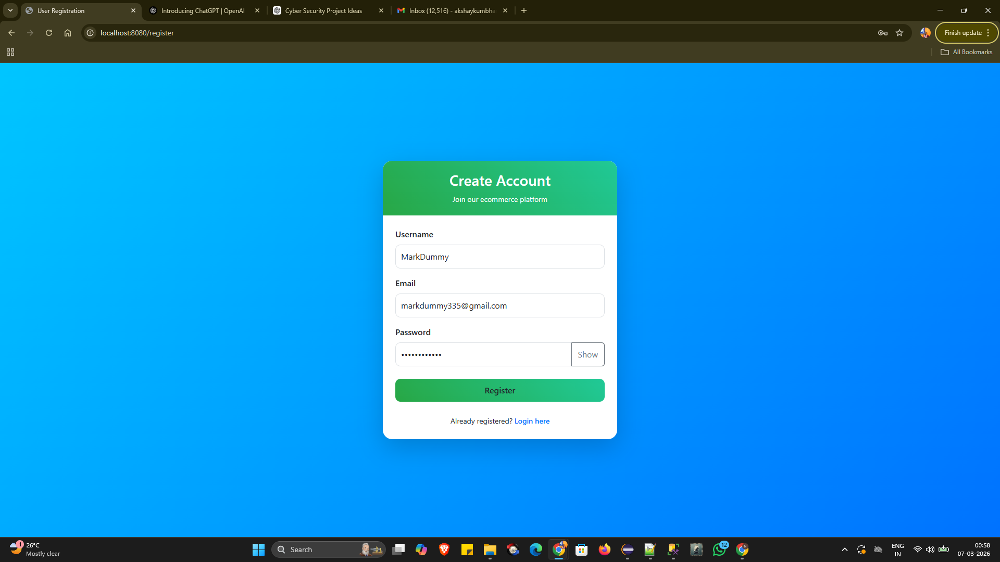

### User Registration (Password Visible)
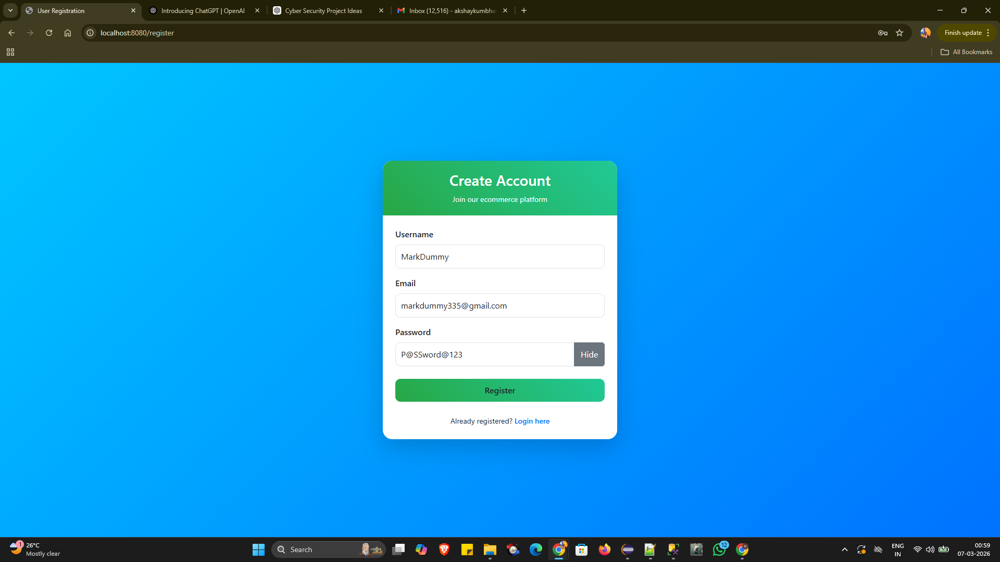

### Admin Dashboard
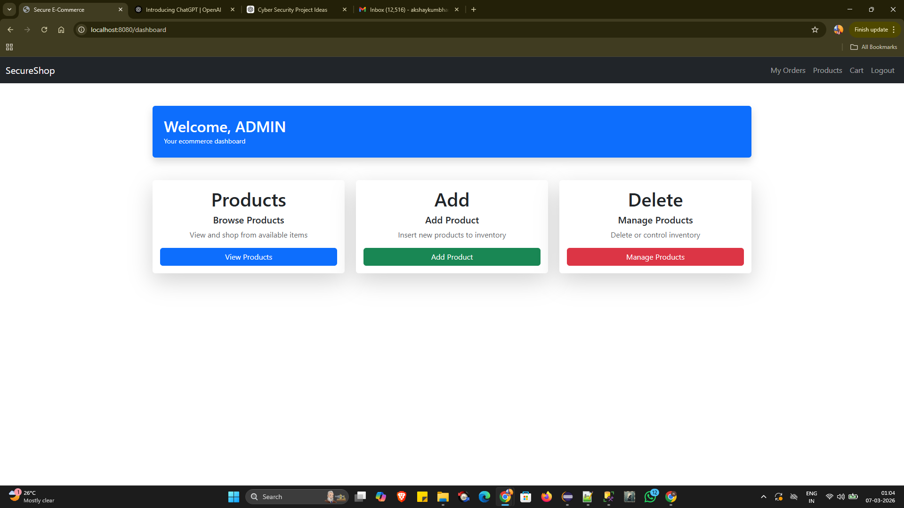

### User Dashboard
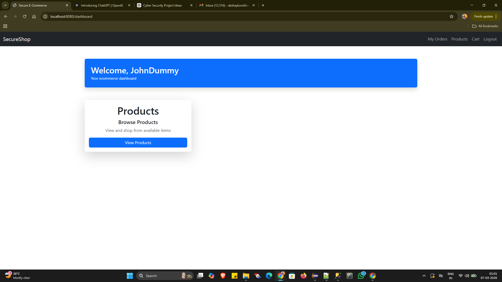

### Product Listing Page
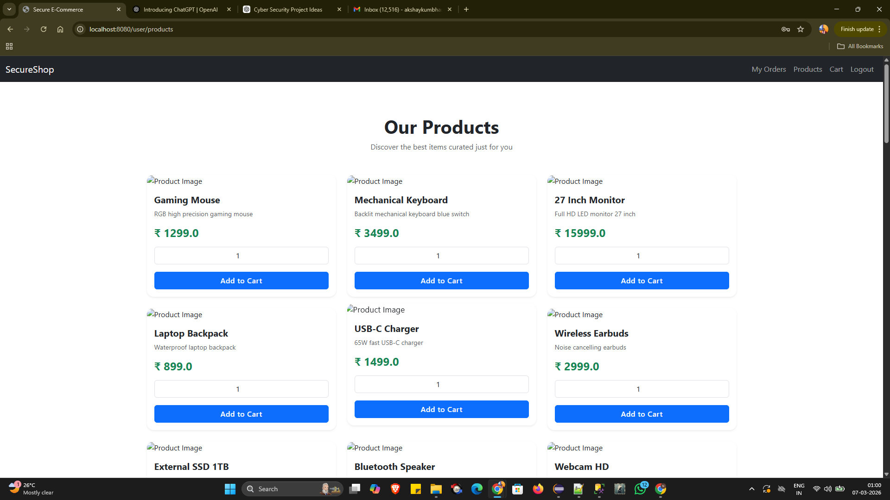

### Shopping Cart (Empty)
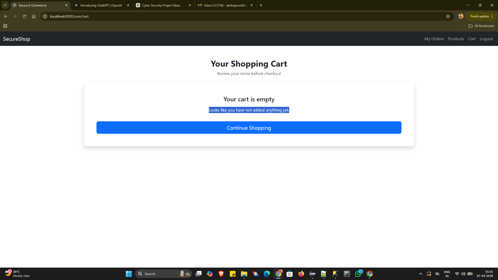

### Shopping Cart With Items
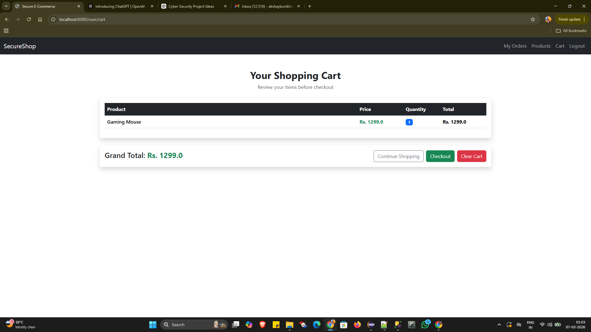

### My Orders Page
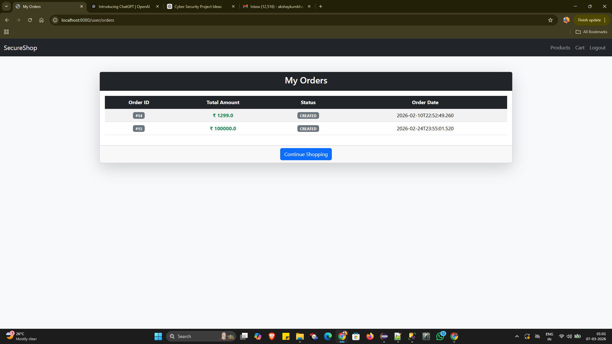

### Order Success Message
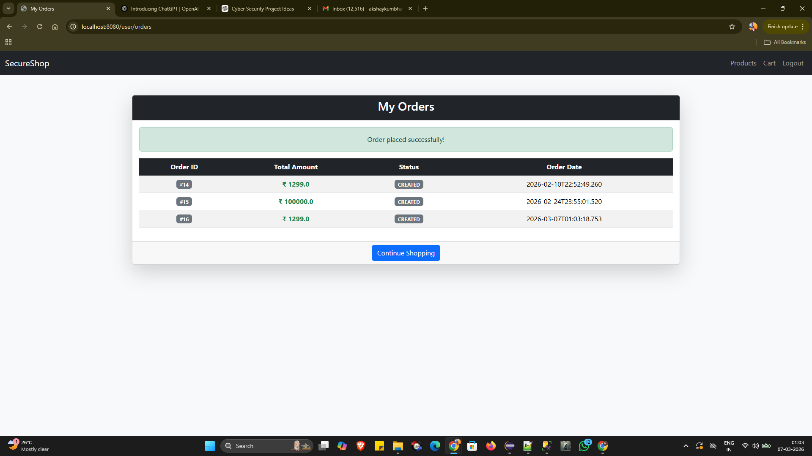

### Admin Product Control Panel
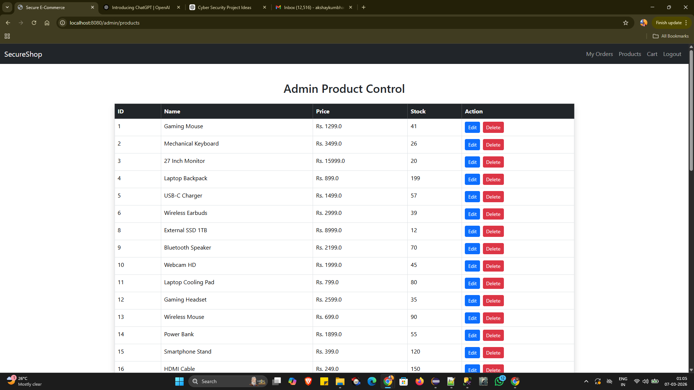

### Add Product Page
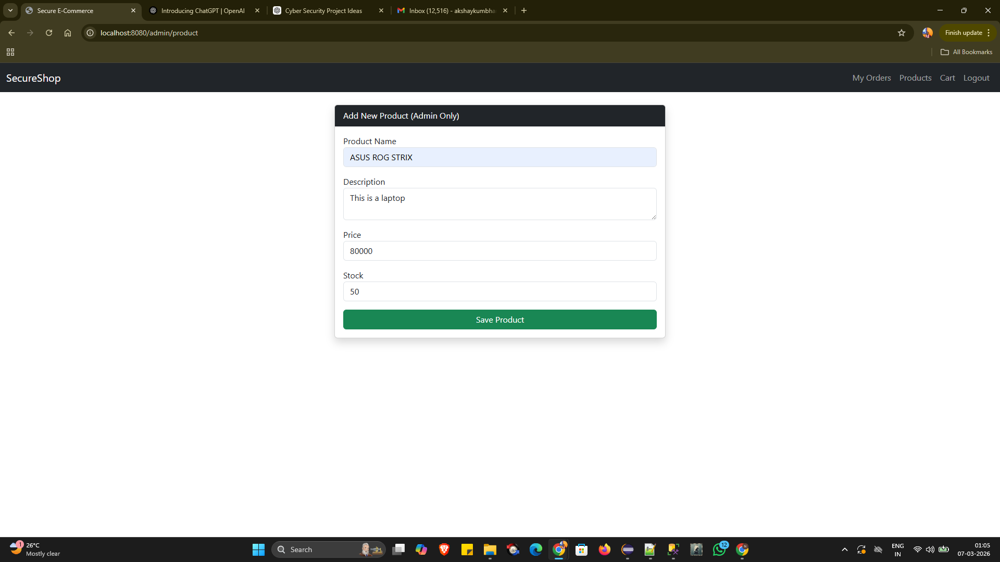

### Edit Product Page
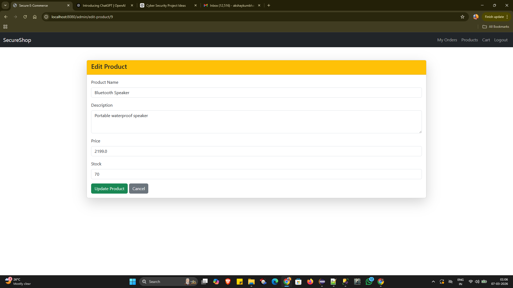

## Future Improvements

Payment Gateway Integration  
Product Image Upload  
Order Tracking  

## Author

Akshay Kumbhar
